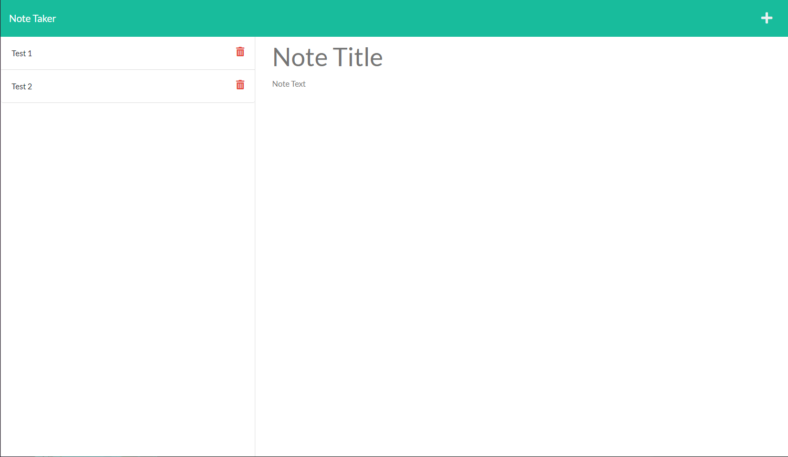

# Express.js Note Taker
  

  ## Description

  This app uses an Express.js server to serve JSON data about user note input to the front end. The user can add notes and delete notes that will persist between reloads as the data is written to a server-side JSON database file.

  ## Table of Contents
  - [Installation](#installation)
  - [Usage](#usage)
  - [Contribution](#contribution)
  - [Questions](#questions)
  - [License](#license)

  

  ## Installation

  Visit https://jwhector-notes.herokuapp.com/ to use the app.

  ## Usage

  Click the "Get Started" button to launch the note-taking app. On the right-hand side there are inputs for a new note's title and content. After inputting content, click the save button in the upper right to save the note to the list on the left. You can access saved notes by clicking on them in the left list and delete entries by clicking the red delete button.
  

  ## Contribution

  Please contact me.

  ## Questions

  [My GitHub](https://github.com/jwhector)

  For further inquiry, contact me at: jared.hector@gmail.com
  
  ## License

  [MIT License](https://choosealicense.com/licenses/mit/)